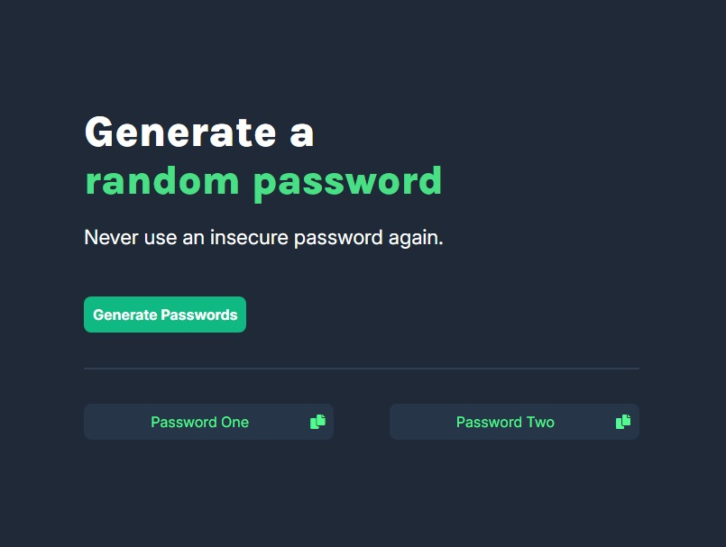

# Password Generator

## Live Demo

Check out the live demo of the Password Generator: [Live Demo](https://albert-password-generator.netlify.app/)

## Overview

This project is a simple, responsive password generator web application. It allows users to generate random passwords with a single click and easily copy them to their clipboard for secure use. The application is designed with a user-friendly interface and built using HTML, CSS, and JavaScript.

## Features

- **Random Password Generation:** Users can generate secure random passwords with just one click.
- **Copy to Clipboard:** Each generated password has a copy icon, allowing users to quickly copy the password to their clipboard.
- **Responsive Design:** The application is fully responsive and works well on various screen sizes, including mobile devices.
- **Smooth User Interactions:** Includes hover effects, tooltips, and transitions for an enhanced user experience.

## Technologies Used

- **HTML5:** For structuring the web page.
- **CSS3:** For styling the user interface, including responsive design and hover effects.
- **JavaScript:** For password generation, clipboard functionality, and tooltips.
- **Font Awesome:** For adding the copy icons next to the passwords.
- **Google Fonts:** For typography, utilizing the "Inter" and "Karla" font families.

## Usage

1. **Load the Application:** Open the `index.html` file in your web browser.
2. **Generate Passwords:** Click the "Generate Passwords" button to create two random passwords.
3. **Copy Password:** Click the copy icon next to either password to copy it to your clipboard.
4. **Responsive Experience:** The design adapts seamlessly to different screen sizes, ensuring a smooth experience on both desktop and mobile devices.

## Future Enhancements
- **Customization Options:** Allow users to customize the length and complexity of the generated passwords.
- **Multiple Password Sets:** Provide options for generating multiple sets of passwords at once.
- **Save Feature:** Enable users to save generated passwords securely within the application.

## License
This project is licensed under the MIT License. See the LICENSE file for more details.

## Author
- **Albert Opoku-Twumasi**
  - GitHub: [oRocket](https://github.com/oRocket)
  - Twitter/X: [@Albert_O_T](https://twitter.com/Albert_O_T)

